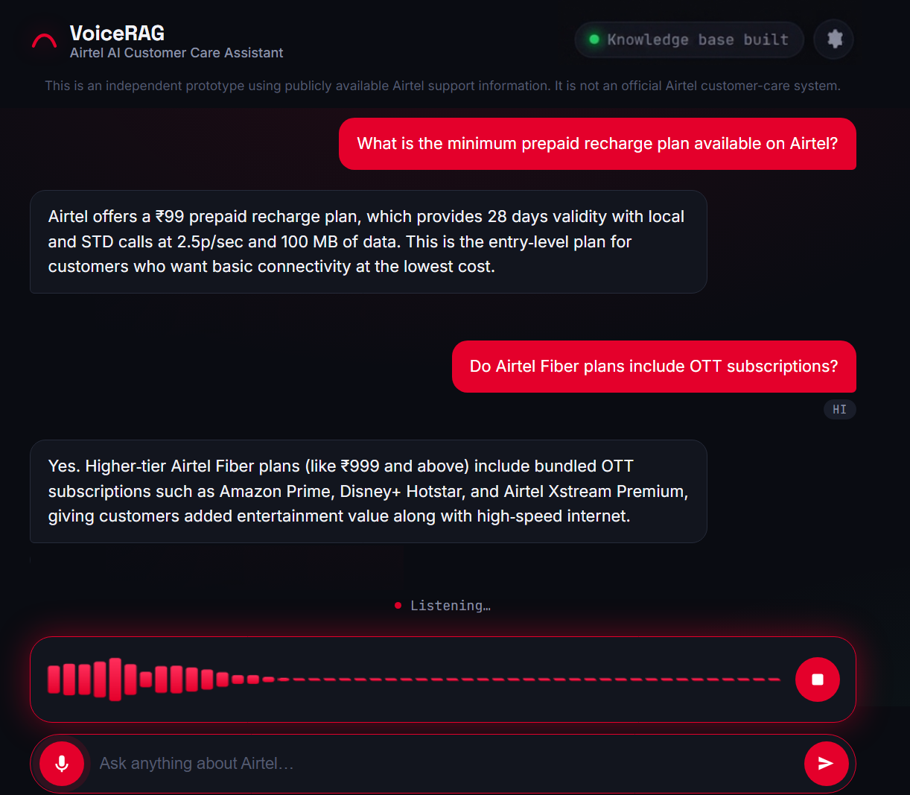
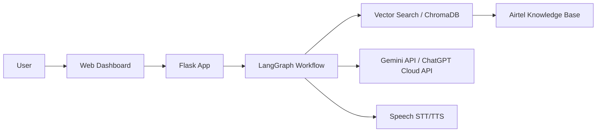
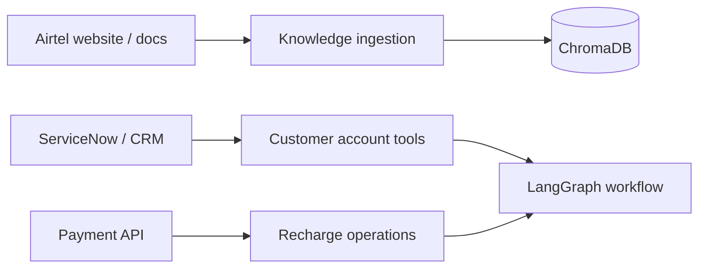

# VoiceRAG — Airtel AI Customer Care Assistant



A simple AI-powered support assistant for Airtel customers. It helps users ask questions about prepaid plans, postpaid usage, broadband, SIM, 5G, recharge, billing, and general support. The app answers using a grounded retrieval workflow and can also work in voice mode.

> This project is an independent prototype for demo and learning use. It is not an official Airtel support system and does not access real customer accounts.

---

## Project overview

This project is a customer support chatbot built with Flask, LangGraph, ChromaDB, and cloud AI APIs. Users can type a question or speak it, and the assistant tries to answer from Airtel support knowledge stored locally in a vector database.

The app is designed to be simple, fast, and useful for support-style conversations. It gives grounded answers, shows support sources, and can escalate when a request is not safe or not supported by the local knowledge base.

## What this app does

- Answers common Airtel support questions
- Supports text and voice-based interaction
- Uses a RAG flow with retrieval from the knowledge base
- Can detect intent and service type
- Provides grounded responses with source references
- Handles multilingual queries, including English and Telugu
- Shows a dashboard with system and knowledge-base status

## Architecture



## Main technologies

- Flask + Socket.IO for the web app and real-time interaction
- LangGraph for the conversational workflow
- ChromaDB for local vector retrieval
- Gemini API and ChatGPT Cloud APIs instead of local Ollama models
- faster-whisper for speech-to-text
- Piper for text-to-speech
- Python for the backend services and agents

## Model and API setup

The project is configured to use cloud model providers rather than a local Ollama server. In practice, the app can use:

- Google Gemini API
- ChatGPT Cloud / OpenAI-compatible API endpoints

This makes the project easier to run in a cloud-friendly environment while still keeping the retrieval logic and support workflow local.

## Knowledge base flow

The app indexes Airtel-style source documents and stores their chunks in ChromaDB. When a user asks a question:

1. The query is embedded.
2. The relevant chunks are retrieved from the knowledge base.
3. The answer is generated using the model API.
4. The result is checked for grounding and safety.

## Dashboard

The project includes a dashboard with:

- system status
- knowledge-base health
- model information
- voice and text interaction controls
- example Airtel support prompts

## Setup

```bash
python -m venv .venv
.venv\Scripts\activate
pip install -r requirements.txt
python app.py
```

Then open the project in the browser at:

```text
http://localhost:5000
```

## Environment variables

Set the required API keys and model names in the `.env` file, such as:

```env
GEMINI_API_KEY=your_key_here
CHATGPT_CLOUD_API_KEY=your_key_here
GEMINI_MODEL=gemini-1.5-flash
CHATGPT_CLOUD_MODEL=gpt-4o-mini
```

## Project purpose

This is a support assistant for Airtel-style customer care use cases. It is designed to quickly answer common user questions in a simple way without needing a full enterprise CRM or backend integration.

## Notes

- This is a prototype for demonstration.
- It does not access real Airtel account data.
- It should be used carefully in real production deployments with proper validation and policies.

## 7. One-time knowledge-base creation

The knowledge base is **assumed to already exist** for the runtime app. To
(re)build it from source documents:

```bash
python scripts/build_knowledge_base.py --source data/sample_docs
```

This is a completely separate, manual process from the Flask runtime. It:

1. Loads `.pdf` / `.txt` / `.md` files from the source directory.
2. Extracts and cleans text (PyMuPDF for PDFs).
3. Chunks text using `CHUNK_SIZE` / `CHUNK_OVERLAP` from `config/settings.py`.
4. Attaches metadata (`source`, `url`, `title`, `category`, `document_type`,
   `chunk_index`, `crawl_timestamp`, `content_hash`).
5. Embeds each chunk with `nomic-embed-text` via Ollama.
6. Persists everything into the ChromaDB collection at
   `knowledge_base/chroma` (`COLLECTION_NAME`, default `airtel_support`).

Two sample Airtel-style FAQ documents are included under
`data/sample_docs/` so you can run the indexer immediately for a demo.

If your existing knowledge base already lives elsewhere, point
`CHROMA_PATH` / `COLLECTION_NAME` in `.env` at it instead of rebuilding —
`services/retrieval_service.py` will just open and query it as-is.

## 8. Runtime architecture

```
User (text or voice)
   -> Flask (app.py)
   -> [voice only] STT
   -> LangGraph workflow (workflows/voice_customer_care_graph.py)
        -> Intent Agent (agents/intent_agent.py)
        -> Retrieval Service (services/retrieval_service.py) -> ChromaDB
        -> Response Agent (agents/response_agent.py)
        -> Grounding Agent (agents/grounding_agent.py)
   -> [voice only] TTS
   -> User
```

## 9. Installation

**Prerequisites (assumed already installed/running):**
- Python 3.11+
- [Ollama](https://ollama.com) running locally with `gemma3:1b`,
  `qwen2.5vl:3b`, and `nomic-embed-text:latest` already pulled.
- `ffmpeg` on PATH (used by faster-whisper for audio decoding).
- Piper voice models downloaded into `tts_models/` (e.g.
  `en_US-lessac-medium.onnx` + `.onnx.json`, `te_IN-medium.onnx` + `.onnx.json`).

```bash
python -m venv .venv
source .venv/bin/activate        # Windows: .venv\Scripts\activate
pip install -r requirements.txt
cp .env.example .env             # adjust if needed
```

## 10. Running the application

```bash
# 1. One-time (or whenever source docs change): build the knowledge base
python scripts/build_knowledge_base.py --source data/sample_docs

# 2. Run the app (never rebuilds the knowledge base itself)
python app.py
```

Open **http://localhost:5000**.

## 11. Configuration

All tunables live in `config/settings.py` and are overridable via `.env`
(see `.env.example`): Ollama URL/models, ChromaDB path/collection,
`TOP_K` / `SIMILARITY_THRESHOLD`, `CHUNK_SIZE` / `CHUNK_OVERLAP`, STT/TTS
settings, Flask host/port, conversation memory limits, grounding/escalation
thresholds, and logging.

## 12. Example questions

**English:** "How can I recharge my Airtel number?" · "How can I change my
broadband plan?" · "What should I do if my broadband is not working?"

**Telugu:** "నా Airtel broadband slow గా ఉంది. ఏం చేయాలి?" · "నా రీచార్జ్
ఫెయిల్ అయింది. ఏం చేయాలి?" · "నా Airtel SIM ని 5G కి ఎలా మార్చాలి?"

**Mixed:** "Recharge fail అయింది, amount deduct అయింది. What should I do?"

These are wired up as clickable example chips in the UI's empty state.

## 13. Safety limitations

- Never accesses real Airtel customer accounts, balances, bills, or
  transaction history.
- Never processes recharges, payments, plan changes, or complaints.
- Never asks for OTP, PIN, password, or card details — the grounding agent
  deterministically blocks any answer containing those terms.
- Answers only from retrieved knowledge; if nothing relevant is retrieved
  or the answer isn't grounded after a retry, it returns a safe fallback
  message instead of guessing.
- Account-specific or low-confidence requests are flagged for escalation
  to official Airtel support channels.

## 14. Future enterprise integrations

The knowledge base, retrieval service, and agents are intentionally
decoupled so a future version could plug in:



None of these integrations are implemented in v1 — v1 is knowledge-based
support only, by design.

---

## Project structure

```
voicerag/
├── app.py                              Flask + Socket.IO entry point
├── config/settings.py                  Centralized configuration
├── agents/                             intent_agent, response_agent, grounding_agent
├── workflows/voice_customer_care_graph.py   LangGraph StateGraph
├── services/                           rag, retrieval, stt, tts, ollama, conversation
├── models/state.py                     LangGraph state schema
├── prompts/                            intent, response, grounding prompt templates
├── knowledge_base/chroma/              Persisted ChromaDB (built offline)
├── scripts/build_knowledge_base.py     One-time indexing pipeline
├── scripts/evaluate.py                 Evaluation harness
├── data/sample_docs/                   Sample Airtel FAQ docs for the demo
├── templates/index.html + static/      Chat UI (HTML/CSS/JS, Web Audio API)
├── tests/                              Unit tests
└── requirements.txt
```

## Testing & evaluation

```bash
pytest tests/
python scripts/evaluate.py --dataset scripts/eval_dataset.json
```

`scripts/evaluate.py` reports retrieval relevance, grounding pass rate,
approximate hallucination rate, intent accuracy, escalation accuracy, and
average end-to-end latency against `scripts/eval_dataset.json`.
